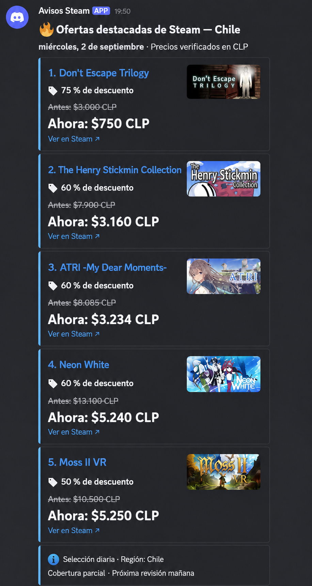
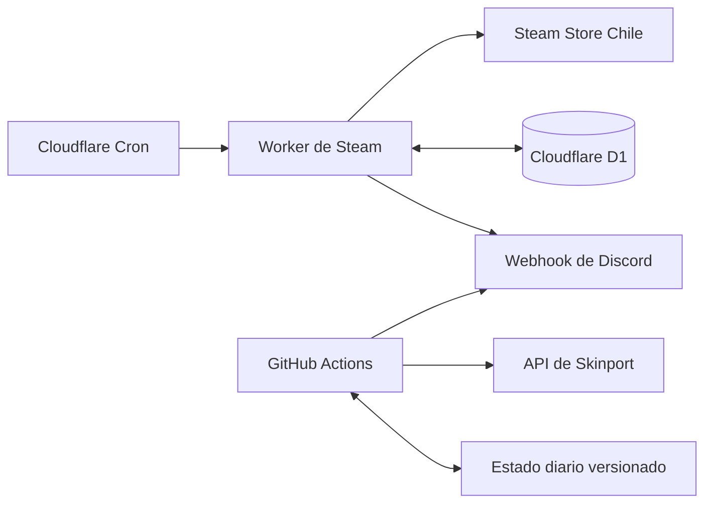

# Steam & Rust Deals para Discord

[](https://github.com/vichinho/steam-discord-alerts/actions/workflows/skinport-network-probe.yml)

Servicio personal que publica en Discord una selección diaria de ofertas de juegos de Steam para Chile y oportunidades de objetos de Rust en Skinport. Funciona en la nube y no necesita que el PC, Steam o Discord permanezcan abiertos.

Está construido en TypeScript con dos ejecutores gratuitos e independientes:

- **Cloudflare Workers + D1:** ofertas de Steam en CLP, estado persistente, deduplicación y reintentos.
- **GitHub Actions:** objetos de Rust obtenidos de Skinport en USD, con un máximo de un resumen diario.
- **Discord Webhook:** publicación en un único canal autorizado, sin Gateway, comandos ni lectura de mensajes.

## Estado

| Módulo | Ejecutor | Horario de Santiago | Estado |
| --- | --- | --- | --- |
| Ofertas de Steam | Cloudflare Worker | Desde las 12:00 | Activo |
| Estrenos de Steam | Cloudflare Worker | Desde las 20:00 | Implementado |
| Objetos de Rust | GitHub Actions + Skinport | Desde las 13:00 | Activo |
| Tienda web de Facepunch | — | — | Desactivado por falta de una API adecuada |

Steam consulta una muestra acotada de la tienda regional y selecciona hasta diez juegos con un descuento mínimo inicial de 50 %. Skinport compara el precio mínimo con su precio sugerido, exige al menos diez unidades y selecciona hasta cinco objetos con una diferencia mínima de 20 %.

Los precios no se convierten entre monedas: Steam se muestra en **CLP** y Skinport en **USD**.

## Ejemplo visual



Cada tarjeta incluye el nombre, porcentaje, precio anterior o de referencia, precio actual y enlace directo. Las menciones de Discord están desactivadas.

## Arquitectura



Los módulos no dependen entre sí. Un fallo de Skinport no detiene Steam y un error de Steam no se interpreta como ausencia de ofertas.

## Requisitos locales

- Node.js `24.x`
- npm
- Wrangler CLI mediante la dependencia del proyecto
- GitHub CLI solo para administrar Actions y secretos desde terminal

No requiere Docker, una base de datos instalada ni dependencias globales.

```powershell
npm ci
npm run validate
```

`validate` ejecuta la comprobación de TypeScript, 44 pruebas automatizadas, una simulación sin red y una compilación de Wrangler sin despliegue.

Otros comandos útiles:

| Comando | Función |
| --- | --- |
| `npm run simulate` | Simulación con datos ficticios, sin red ni secretos |
| `npm run preview:steam` | Vista previa del resumen de Steam |
| `npm run probe:steam` | Prueba técnica acotada de la fuente de Steam |
| `npm run probe:skinport` | Prueba técnica del catálogo de Skinport |
| `npm run skinport:github` | Vista previa usada por GitHub Actions |
| `npm run db:local` | Aplica las migraciones en D1 local |
| `npm run build` | Compila el Worker sin desplegarlo |

## Configuración

La configuración versionada vive en [`config/bot.json`](config/bot.json). Los valores principales son:

| Campo | Valor actual |
| --- | --- |
| Región de Steam | Chile (`CL`) |
| Moneda de Steam | Peso chileno (`CLP`) |
| Descuento mínimo de Steam | 50 % |
| Máximo de ofertas de Steam | 10 por resumen |
| Moneda de Skinport | Dólar estadounidense (`USD`) |
| Diferencia mínima de Skinport | 20 % bajo el precio sugerido |
| Liquidez mínima de Skinport | 10 unidades |
| Máximo de objetos de Rust | 5 por resumen |
| Zona horaria | `America/Santiago` |

Los secretos nunca se guardan en `bot.json`, commits, fixtures o registros.

## Secretos y activación

Cloudflare guarda su propia copia del webhook:

```powershell
npx wrangler secret put DISCORD_WEBHOOK_URL
```

GitHub Actions usa un secreto independiente con el mismo nombre:

```powershell
gh secret set DISCORD_WEBHOOK_URL
```

La programación de Skinport solo funciona cuando la variable del repositorio está activa:

```powershell
gh variable set SKINPORT_ENABLED --body true
```

Para pausarla sin borrar el secreto:

```powershell
gh variable set SKINPORT_ENABLED --body false
```

El flujo manual permite revisar el resultado sin publicar. El envío real requiere seleccionar explícitamente la opción `send` y verifica que el webhook pertenezca al canal configurado.

## Persistencia y protección contra duplicados

Steam usa D1 para conservar cursores, estado de ofertas, leases y una outbox de entregas. Los errores recuperables se reintentan con espera; una respuesta ambigua de Discord no se reenvía automáticamente.

Skinport guarda el último día entregado y el identificador del mensaje en [`data/skinport-state.json`](data/skinport-state.json). GitHub Actions ejecuta dos comprobaciones UTC para cubrir los cambios de hora de Chile, pero el programa consulta la fuente solo después de las 13:00 y detiene la segunda ejecución si el día ya fue enviado.

## Seguridad

- No inicia sesión en Steam, Skinport ni cuentas de usuarios.
- No lee inventarios, bibliotecas, listas de deseos o mensajes de Discord.
- No compra artículos ni crea órdenes automáticamente.
- Verifica el ID del webhook y del canal antes de publicar.
- Desactiva todas las menciones y sanea títulos y enlaces.
- No expone rutas HTTP públicas en el Worker.
- Limita solicitudes, tamaño de respuestas, candidatos y publicaciones.

## Limitaciones

- La cobertura de Steam es parcial y depende de interfaces de tienda sin garantía pública de estabilidad.
- Skinport entrega precios globales en USD; no ofrece precios CLP en este flujo.
- El precio sugerido de Skinport es una referencia del mercado, no un descuento oficial de Steam ni una recomendación de compra.
- Un resumen diario representa la selección encontrada en esa ejecución, no todos los juegos u objetos disponibles.
- GitHub Actions y los cron de Cloudflare pueden comenzar algunos minutos después del horario configurado.

## Estructura

```text
.github/workflows/              Automatización diaria de Skinport
config/bot.json                 Filtros y barreras de activación
data/skinport-state.json        Deduplicación diaria de Skinport
migrations/                     Esquema versionado de D1
scripts/                        Pruebas, vistas previas y utilidades
src/engine.ts                   Motor de Steam
src/skinport-engine.ts          Integración de Skinport para Workers
src/providers/                  Adaptadores de datos
src/notifications/discord.ts    Formato y publicación en Discord
src/storage/repository.ts       Persistencia, leases y outbox
tests/                          Pruebas automatizadas
docs/                           Diseño, operación y evidencia técnica
```

## Documentación

- [`SDD.md`](SDD.md): especificación y decisiones de diseño.
- [`docs/OPERATIONS.md`](docs/OPERATIONS.md): despliegue, inspección y recuperación.
- [`docs/CLOUDFLARE.md`](docs/CLOUDFLARE.md): estado de la infraestructura de Steam.
- [`docs/RUST-ITEMS.md`](docs/RUST-ITEMS.md): reglas y validación de objetos de Rust.
- [`docs/SOURCE-ACCESS.md`](docs/SOURCE-ACCESS.md): alcance y revisión de las fuentes.
- [`docs/ACCEPTANCE.md`](docs/ACCEPTANCE.md): criterios de aceptación y evidencia.

Proyecto de uso personal, sin monetización y diseñado para mantenerse dentro de los planes gratuitos utilizados.
