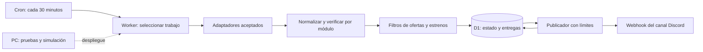

# SDD — Avisos de Steam para un servidor de Discord

**Tipo:** Software Design Document / Documento de diseño de software  
**Versión:** 1.3 — 3 de septiembre de 2026
**Estado:** proceso propio activo; primer resumen real confirmado, observación operativa en curso.  
**Uso:** personal, un servidor de Discord, sin monetización.  
**Presupuesto de alojamiento:** USD 0; no habilitar planes ni componentes de pago.

## 1. Objetivo

Desarrollar un servicio que detecte ofertas de Steam según filtros configurables y publique avisos en un canal de texto del servidor del propietario. También debe informar sobre juegos recién lanzados mediante un resumen diario.

La versión 1.1 añade al alcance futuro promociones de la tienda oficial de Rust y oportunidades de skins u objetos de Rust en el Mercado de la Comunidad de Steam. Cada módulo tiene una fuente y barreras de activación independientes, descritas en [docs/RUST-ITEMS.md](docs/RUST-ITEMS.md).

El desarrollo y las pruebas se realizan en Windows. La ejecución habitual se realiza en Cloudflare, independientemente de que el PC esté encendido. No se requiere mantener Discord ni Steam abiertos en el PC.

La versión inicial prioriza información correcta, poco ruido y costo cero. No promete recorrer todo el catálogo de Steam ni avisos instantáneos. La cobertura concreta debe verificarse y quedar visible en la configuración y la documentación operativa.

## 2. Requisitos confirmados y supuestos

### Confirmado por el propietario

- Solo Steam y un servidor propio de Discord.
- Ofertas seleccionadas mediante filtros, no solamente una lista manual de juegos.
- Avisos de nuevos lanzamientos.
- Promociones de la tienda oficial de Rust y objetos más baratos del Mercado de Steam para Rust.
- Alojamiento gratuito y funcionamiento sin depender del PC.
- Desarrollo y pruebas locales, procurando no llenar el equipo de instalaciones innecesarias.
- No se implementará monetización.

### Valores iniciales propuestos, modificables

No son preferencias confirmadas. Permiten implementar sin bloquear el trabajo por decisiones menores.

| Opción | Valor inicial |
| --- | --- |
| Región / moneda esperada | Chile (`CL`) / peso chileno (`CLP`) |
| Idioma de mensajes / zona horaria | Español / `America/Santiago` |
| Canal | Uno para ofertas y estrenos, diferenciados por etiqueta |
| Descuento mínimo | 50 %, inclusive |
| Precio máximo | Sin límite |
| Géneros incluidos | Todos; lista configurable con coincidencia de cualquiera |
| Productos | Juegos base; excluir DLC, demos, software, bandas sonoras y paquetes |
| Early Access | Incluir y etiquetar cuando el dato esté disponible |
| Ofertas | Un resumen diario desde las 12:00 de Santiago; hasta 10 juegos no publicados en los 7 días anteriores, descubiertos en hasta 5 páginas por reseñas y ordenados localmente por descuento |
| Descubrimiento de estrenos | Cada 6 horas |
| Resumen de estrenos | A las 20:00 de Santiago, o en la primera ejecución posterior exitosa |
| Ventana de estrenos | Últimos 7 días, sin repetir los ya anunciados |
| Límite de avisos | Un resumen de ofertas por día local, máximo 10 juegos |
| Resumen diario | Máximo 10 estrenos en un único mensaje compacto |
| Menciones | Desactivadas, incluido `@everyone` |

Los filtros de descuento y precio de ofertas no se aplican a estrenos. Estos tienen filtros propios de género y tipo de producto. No se descarta un estreno por carecer de reseñas.

## 3. Alcance de la primera versión

### Incluido

1. Obtener candidatos desde una fuente aceptada, con cobertura documentada.
2. Verificar identidad, disponibilidad regional, tipo de producto y datos necesarios.
3. Filtrar ofertas y estrenos de manera independiente.
4. Publicar mensajes con nombre, enlace y datos verificables; imagen en ofertas cuando esté disponible.
5. Guardar configuración, estado, historial y entregas pendientes.
6. Evitar avisos repetidos entre ejecuciones y despliegues normales.
7. Reintentar fallos recuperables sin saturar Steam ni Discord.
8. Disponer de simulación local sin envíos, registros operativos y pausa global.
9. Incorporar, tras validación independiente, promociones oficiales de Rust y caídas de precio del Mercado de Steam para Rust.

### Fuera de alcance

- Comandos `/configurar`, `/seguir`, panel web y bot conectado permanentemente al Gateway.
- Varios servidores, suscripciones, cobros, afiliación y publicidad.
- Leer mensajes, perfiles, bibliotecas o listas de deseados de usuarios.
- Compra automática de juegos, inicio de sesión en Steam o acceso a contraseñas.
- Garantizar mínimos históricos, cobertura completa o todas las promociones gratuitas.
- Anunciar próximos lanzamientos como si ya estuvieran disponibles.
- Clasificar automáticamente un precio cero como un regalo para conservar.

Se usará un **webhook de Discord** con nombre y avatar propios. Cumple el objetivo de publicar avisos, pero no aparece como un bot permanentemente conectado ni atiende comandos. Discord documenta la publicación mediante webhooks entrantes. [Referencia](https://docs.discord.com/developers/resources/webhook).

## 4. Decisiones de arquitectura

| Decisión | Justificación |
| --- | --- |
| TypeScript y Cloudflare Workers | Un lenguaje para lógica, pruebas y ejecución en la nube |
| Cron Trigger | Ejecutar revisiones periódicas sin mantener un proceso local |
| D1 en plan gratuito | Persistencia SQL para deduplicación, cursores y entregas |
| Webhook de Discord | Publicación sencilla en un canal, sin leer mensajes |
| Configuración versionada | Ajustar filtros sin construir un panel ni autenticación adicional |
| Adaptador de datos separado | Cambiar una fuente sin reescribir filtros ni notificaciones |
| Sin servidor HTTP público en producción | Reducir superficie de ataque y consumo accidental |
| Dependencias mínimas | Mantener bajo el consumo y evitar instalaciones globales innecesarias |



No hacen falta dominio propio, máquina virtual, Docker, navegador automatizado ni base de datos instalada como servicio en Windows.

## 5. Fuente de datos: validación obligatoria

### 5.1 Situación actual

El propietario aceptó el 2 de septiembre de 2026 desarrollar el proceso propio con consultas públicas acotadas de Steam, conociendo que las rutas regionales de tienda no tienen un contrato público de estabilidad ni una autorización específica confirmada para este bot. La cobertura parcial está aceptada; falta validar su ejecución desde Cloudflare antes de habilitar mensajes.

La interfaz oficial `IStoreService.GetAppList` ofrece descubrimiento de aplicaciones y cambios. Su campo `last_modified` indica modificaciones en información o precio, **no la fecha de lanzamiento**. Por sí sola no satisface las alertas solicitadas. Se comprobarían también sus requisitos de acceso antes de usarla. [Documentación de Steamworks](https://partner.steamgames.com/doc/webapi/IStoreService?l=english).

La tienda muestra resultados ordenados por fecha de lanzamiento. Eso prueba la existencia de esa información en la tienda, pero no constituye un contrato de API para terceros. [Catálogo por fecha](https://store.steampowered.com/search/?sort_by=Released_DESC&category1=998).

### 5.2 Adaptador seleccionado

Usar un adaptador de lectura de la tienda de Steam para descubrimiento acotado y comprobación de detalles regionales. La búsqueda de ofertas y `api/appdetails` funcionaron en la prueba local con región Chile y precios CLP. Siguen siendo interfaces de tienda sin estabilidad garantizada por la documentación pública de Valve.

No se utilizarán endpoints internos restringidos, sesiones de usuario, evasión de bloqueos, rotación de identidades ni extracción masiva. La accesibilidad técnica no equivale a autorización. Las condiciones de la Web API tampoco se asumirán como una licencia automática para otros endpoints de la tienda. [Condiciones de Steam Web API](https://steamcommunity.com/dev/apiterms).

### 5.3 Criterios de aceptación de la fuente

- Acceso compatible con uso personal y sin contratación obligatoria.
- Precios reales de Chile con moneda explícita; no convertir USD para simular precios regionales.
- Identificador estable del juego, enlace y tipo de producto verificable.
- Para estrenos: disponibilidad efectiva y fecha suficientemente precisa.
- Consultas paginadas o conjunto acotado, sin barrer el catálogo en cada ejecución.
- Validación desde el PC y desde Cloudflare: una fuente accesible localmente puede fallar desde la nube.
- Medición de tamaño de respuesta, llamadas y CPU compatible con el plan gratuito.
- Documentación de cobertura: resultados consultados, ordenación, paginación y juegos potencialmente omitidos.

Si solo funciona un listado de destacados, la cobertura será parcial. **No se cambiará silenciosamente el alcance a solo destacados:** se presentará esa limitación antes de activar el servicio. Un error de la fuente tampoco se registrará como “no hay ofertas”.

### 5.4 IsThereAnyDeal

Fue consultado por correo con autorización del propietario. El proveedor confirmó que permite el uso privado descrito, pero no ofrece precios reales de Steam para Chile en CLP y exige usar los enlaces entregados por su API. Esto incumple los criterios regionales y de enlace de esta versión, por lo que no se incorpora ni se registra una aplicación. Véanse [la consulta y su resultado](docs/CONTACT-ITAD.md) y las [condiciones del proveedor](https://docs.isthereanydeal.com/).

Si ninguna fuente cumple acceso, permisos, datos regionales y presupuesto, se informará del impedimento; no se contratará otra ni se eludirán restricciones. Se puede avanzar mientras tanto con fixtures locales, filtros y persistencia.

### 5.5 Objetos de Rust

La tienda oficial de Rust y el Mercado de la Comunidad son fuentes distintas y no heredan la eventual aprobación del proveedor de precios de juegos. Las reglas, valores iniciales y barreras de cada módulo están en [docs/RUST-ITEMS.md](docs/RUST-ITEMS.md). El propietario aplazó ambos módulos el 1 de septiembre de 2026 hasta resolver Steam. Permanecen deshabilitados y no modifican los flujos existentes.

## 6. Modelo normalizado

Los módulos posteriores no dependerán del formato específico del proveedor.

| Campo | Regla |
| --- | --- |
| `appId` | Identificador Steam validado, no nombre como clave |
| `title`, `storeUrl`, `imageUrl` | Texto saneado; URL de tienda construida con el identificador |
| `productType`, `genres`, `earlyAccess` | Metadatos con valor desconocido explícito |
| `country`, `currency` | Región solicitada y moneda devuelta verificadas |
| `originalAmount`, `currentAmount`, `amountScale` | Enteros y escala declarada por el adaptador, sin aritmética monetaria flotante |
| `discountPercent` | Coherente con importes; rechazar diferencias inexplicables |
| `releaseDate`, `releasePrecision`, `comingSoon` | No interpretar una fecha incompleta como un día exacto |
| `availableInRegion` | Verdadero, falso o desconocido |
| `observedAt`, `source`, `sourceUrl` | Trazabilidad y antigüedad de los datos |
| `promotionEndsAt` | Opcional; no inventar fin de oferta |

Un campo ausente no equivale a cero, gratis, sin descuento o juego lanzado. Si falta un dato exigido por un filtro activo, se omite el candidato y se registra la razón. Se omiten imágenes inválidas sin descartar el resto del aviso.

## 7. Flujos y reglas funcionales

### 7.1 Planificación

Un único Cron Trigger dispara el Worker cada 30 minutos para reintentos y tareas pendientes. El cron opera en UTC; el código calcula días y horarios con `America/Santiago`, contemplando cambios de hora. D1 registra por separado las fechas locales de los resúmenes de ofertas y estrenos para enviar cada uno una sola vez al día. [Cron Triggers](https://developers.cloudflare.com/workers/configuration/cron-triggers/).

La búsqueda de ofertas ocurre una vez al día desde las 12:00 de Santiago; la de estrenos, cada seis horas transcurridas. Los reintentos pendientes se atienden en ejecuciones posteriores. Los lotes usan cursores persistentes donde corresponde y no requieren completar un catálogo dentro de una invocación.

### 7.2 Ofertas

1. Adquirir un bloqueo temporal en D1 y leer configuración y cursor.
2. Recorrer hasta cinco páginas pequeñas, excluir identificadores publicados en los siete días anteriores y comprobar como máximo diez fichas.
3. Exigir juego base, disponible en la región, moneda correcta y precio válido.
4. Aplicar todos los filtros activos: descuento mínimo, máximo de precio y géneros.
5. Ordenar por descuento descendente, precio ascendente y `appId` como desempate.
6. Ordenar los candidatos verificados y agrupar hasta diez en un resumen diario.
7. Reservar una única entrega para la fecha local.
8. Publicar y registrar la respuesta de Discord; liberar bloqueo.

El resumen no vuelve a incluir un juego enviado durante los siete días anteriores. Si no existen suficientes alternativas válidas, contiene menos de diez juegos o no se publica. Al cumplirse la ventana, una oferta todavía vigente puede volver a aparecer. Nunca se envía más de un resumen de ofertas para la misma fecha local. La ausencia del juego en las páginas consultadas no prueba que la oferta terminó.

Las entregas pendientes de ofertas caducan a las 24 horas y deben revalidarse si su observación tiene más de 30 minutos. Los excedentes se contabilizan como omitidos por cupo, no se acumulan indefinidamente.

### 7.3 Nuevos lanzamientos

Un estreno es un juego disponible, con `comingSoon=false` y una fecha confirmada dentro de los últimos siete días. Haber descubierto un `appId` nuevo, una actualización de precio o una modificación de metadatos no basta.

Se guardan candidatos elegibles y, al horario del resumen, se seleccionan hasta diez no anunciados. Se ordenan por fecha de lanzamiento descendente y `appId`. El acceso anticipado se etiqueta; la transición posterior a versión 1.0 no se trata como otro estreno en esta versión.

Si no hay novedades elegibles, no se envía un mensaje vacío. Los fallos se registran por separado. Si hay más de diez candidatos verificados, el mensaje indica cuántos quedaron fuera del resumen, sin afirmar que se encontraron todos los estrenos de Steam.

### 7.4 Primera ejecución y cambios de filtros

La primera ejecución mantiene una línea base silenciosa para estrenos. En modo de resumen diario, las ofertas actuales sí pueden formar el primer resumen una vez habilitados los envíos. Se ofrece una vista previa local para verificar los filtros.

Ampliar filtros o cambiar región no provoca un envío masivo: se reconstruye la línea base para la nueva configuración. Cambiar solo el horario no elimina el historial. El historial de una región nunca se usa para comparar precios de otra.

### 7.5 Mensajes

Ejemplo ficticio de oferta:

> **OFERTA · Nombre del juego**  
> 60 % de descuento  
> Antes: $20.000 CLP · Ahora: $8.000 CLP  
> Precio observado en Steam Chile · enlace al juego

Ejemplo ficticio de resumen:

> **ESTRENOS · 31 de agosto**  
> Juego A — Lanzado el 31/08 — $12.000 CLP — enlace  
> Juego B — Acceso anticipado — Lanzado el 30/08 — enlace

El precio de estrenos es opcional si no puede confirmarse, siempre que sí se confirme disponibilidad regional. Fechas de fin de promoción se muestran solo cuando existen. Se utilizan enlaces, no copias locales de imágenes o videos.

## 8. Persistencia y entrega

### Tablas previstas

| Tabla | Contenido principal |
| --- | --- |
| `job_state` | Cursores, marcas de ejecución, fecha local de resumen, versión de configuración |
| `leases` | Bloqueo con propietario, vencimiento y operaciones condicionales atómicas |
| `games` | Metadatos y última observación, por `appId` y región |
| `deal_state` | Período de oferta, último precio notificado y transición explícita sin descuento |
| `releases` | Fecha, elegibilidad, identificador del resumen y estado de anuncio |
| `outbox` | Clave única, payload, estado, intentos, próxima ejecución, ID de mensaje y error saneado |
| `runs` | Resumen de ejecución, duración, contadores y estado de fuentes |

Crear índices para las claves únicas, `next_attempt_at`, caducidad y fechas; evitar escaneos completos. Usar migraciones SQL versionadas y transacciones o lotes atómicos donde corresponda.

### Idempotencia y ambigüedad

La clave lógica de oferta incluye destino, región, `appId`, período de oferta y precio anunciado; la de estreno incluye destino, región y `appId`. Un índice único evita que dos ejecuciones creen la misma entrega. Los cupos incluyen mensajes confirmados y reservas pendientes, para que los reintentos no los sobrepasen.

El webhook se ejecuta con `wait=true` para obtener el mensaje creado y guardar su ID. D1 y Discord no comparten una transacción: **no se promete entrega exactamente una vez**. [Comportamiento del webhook](https://docs.discord.com/developers/resources/webhook).

Estados: `pending`, `sending`, `sent`, `retry`, `uncertain`, `expired`, `failed`. Una caída después de publicar pero antes de persistir puede dejar una entrega ambigua. Un `sending` abandonado pasa a `uncertain`, no se reenvía automáticamente. El propietario puede comprobar el canal y resolverla manualmente. Esto reduce duplicados a costa de posibles avisos omitidos en fallos excepcionales.

### Retención

- Registros de ejecuciones: 30 días.
- Payloads de entregas terminales: 30 días; conservar la clave compacta de deduplicación.
- Metadatos inactivos: purga a los 90 días.
- Estado compacto de oferta y estrenos anunciados: persistente, con seguimiento de tamaño.
- No eliminar claves automáticamente si ello produciría una repetición. Ante presión de cuota, pausar y revisar la retención.

## 9. Presupuesto gratuito y rendimiento

Cloudflare publica para Workers Free 100.000 solicitudes diarias, 10 ms de CPU por invocación y 50 subsolicitudes por invocación. La espera de red no es CPU, pero analizar y transformar respuestas sí lo es. Este último límite requiere pruebas reales; un volumen diario pequeño no garantiza que cada ejecución sea admisible. [Límites](https://developers.cloudflare.com/workers/platform/limits/).

D1 Free incluye 5 millones de filas leídas al día, 100.000 escritas al día y 5 GB de almacenamiento total. Las cuotas corresponden a la cuenta y pueden compartirse con otros proyectos. [Precios de D1](https://developers.cloudflare.com/d1/platform/pricing/).

### Presupuesto interno inicial — objetivos de diseño, no mediciones

- 48 disparos programados por día; 4 incluyen descubrimiento de estrenos.
- Hasta 10 comprobaciones individuales de juegos por invocación, repartidas entre ofertas y estrenos según trabajo pendiente.
- Máximo 40 subsolicitudes totales contabilizadas, incluyendo acceso a servicios, redirecciones y operaciones de persistencia según las reglas de Cloudflare; reservar margen bajo el límite de plataforma.
- Concurrencia de red máxima: 2; paginación pequeña y payloads acotados.
- Objetivo de CPU: percentil 95 inferior a 7 ms y ninguna superación observada del límite en la prueba representativa. Esto no garantiza que nunca ocurra una superación futura.
- Objetivos diarios: menos de 20.000 filas D1 leídas y 5.000 escritas; revisar consumo real de índices.
- Tiempo máximo de red por solicitud: 10 segundos; no realizar esperas largas para reintentar dentro de la misma ejecución.

Si el trabajo no cabe, reducir lotes, frecuencia de enriquecimiento o cobertura visible y persistir progreso. No incrementar automáticamente el presupuesto. La consulta de todo Steam cada 30 minutos no forma parte de esta estimación.

El despliegue conservará Workers y D1 en modalidad gratuita, sin suscripciones pagadas, tarjeta para upgrades, dominio contratado ni componentes con facturación por uso habilitada. No se presupone que un aviso de gasto sea un límite de facturación. Si se agota una cuota gratuita, se acepta una pausa o degradación; no se contrata capacidad. Verificar condiciones de cuenta antes de desplegar. [Precios de Workers](https://developers.cloudflare.com/workers/platform/pricing/).

## 10. Seguridad, errores y operación

### Secretos y permisos

- Guardar `DISCORD_WEBHOOK_URL` como secreto de Cloudflare; en local, archivo ignorado por Git.
- No pegar el webhook en documentación, capturas, mensajes, fixtures ni registros.
- El webhook puede crearse por alguien con permisos para gestionarlo; el servicio no necesita permisos de administrador, lectura de mensajes ni un token de bot.
- No exponer configuración o estado en endpoints públicos. Desactivar rutas de acceso público y previews de producción cuando sea posible.
- Desactivar menciones con `allowed_mentions: { parse: [] }`; escapar títulos y respetar límites de longitud de Discord.
- Aceptar solo hosts esperados; validar redirecciones. Datos de Steam no pueden determinar destinos de publicación ni solicitudes arbitrarias.
- La simulación nunca usa el webhook de producción. Antes de una prueba real, identificar el canal de prueba elegido por el propietario.
- Publicar únicamente en el destino autorizado. No crear otros canales ni enviar mensajes privados.

### Recuperación

| Incidente | Respuesta |
| --- | --- |
| Steam responde 429 | Respetar espera indicada, posponer y conservar cursor |
| Fuente inaccesible o cambia el esquema | No publicar datos dudosos; registrar fallo y pausar el adaptador si persiste |
| Precio o moneda inválidos | Omitir candidato, sin convertir o inventar datos |
| Discord responde 429 | Posponer según `retry_after`; sin espera larga en el Worker |
| Discord 401/403/404 | Pausar envíos y requerir revisión del webhook |
| Error recuperable previo al envío | Hasta 3 intentos diferidos, con esperas crecientes |
| Respuesta de entrega ambigua | Marcar `uncertain`; revisión manual, sin reenvío ciego |
| D1 falla antes de reservar entrega | No enviar; evitar una publicación sin control de estado |
| Se supera cuota o límite de CPU | Registrar cuando sea posible y reducir carga; sin upgrade |

Cada ejecución registra cantidades descubiertas, elegibles, omitidas, pendientes, enviadas y fallidas; última consulta correcta por fuente y antigüedad de datos. Nunca registrar cuerpos completos de errores que puedan contener secretos.

Revisar métricas diariamente durante la prueba inicial y semanalmente después. Tras tres fallos consecutivos de una fuente, puede emitirse un aviso operativo único en el canal autorizado si Discord funciona. No hay monitor externo incluido: si todo el servicio se detiene, no se garantiza una alerta automática.

Para pausar, desactivar el cron o `enabled`. Para revertir código, volver a una versión anterior compatible con el esquema. Las migraciones iniciales serán aditivas; exportar D1 antes de cambios destructivos. Conservar historial al redeployar.

## 11. Desarrollo local sin procesos permanentes

Estructura prevista, todavía no creada:

```text
SDD.md
README.md
package.json
package-lock.json
wrangler.jsonc
config/bot.json
src/worker.ts
src/config.ts
src/providers/steam.ts
src/domain/normalize.ts
src/domain/filters.ts
src/domain/deals.ts
src/domain/releases.ts
src/storage/repository.ts
src/notifications/discord.ts
migrations/
tests/fixtures/
.dev.vars.example
.gitignore
```

Usar una versión LTS vigente de Node.js compatible con Wrangler al implementar. Instalar dependencias del proyecto localmente, sin instalaciones globales. Se generarán `node_modules`, archivos de compilación y estado local de Wrangler; las herramientas también pueden usar cachés del usuario. No prometer que todos los archivos quedarán exclusivamente en la carpeta del proyecto.

Pruebas con Vitest o el ejecutor compatible elegido al fijar versiones; simulación de D1 y del webhook. Se debe poder ejecutar una revisión única y terminar. No crear tareas de inicio de Windows ni servicios residentes. Tras el despliegue, cerrar el proceso local sin afectar las alertas en Cloudflare.

El consumo se medirá durante pruebas. Como expectativa, la lógica sin navegador será liviana; el entorno de desarrollo puede usar bastante más memoria que un script mínimo. No se fija el rango orientativo de RAM mencionado en la conversación como garantía contractual.

## 12. Plan de implementación y criterios de aceptación

### Fase 0 — Demostrar viabilidad

Validar fuente, condiciones de acceso, moneda CLP, tipos de producto, precisión de lanzamientos y cobertura. Hacer un prototipo mínimo con simulación de mensajes y medición en Workers Free. No publicar alertas reales ni habilitar planes de pago durante esta fase.

**Salida:** adaptador viable y evidencia de consumo. Si no existe, informe del impedimento con alternativas explícitas; no declarar resuelto el bot completo.

### Fase 1 — Núcleo local

Implementar configuración, normalización, filtros, línea base, estados de oferta, estrenos y renderizado de mensajes. Validar con datos de prueba reproducibles y ejecutar en modo sin envíos.

### Fase 2 — Persistencia y entrega

Agregar D1, migraciones, índices únicos, bloqueo, cupos, outbox, reintentos y tratamiento de entregas ambiguas. Preparar una prueba controlada con el webhook del canal elegido.

### Fase 3 — Cloudflare y operación

Configurar cuenta gratuita, secretos, D1 y cron; comprobar que no se activa facturación pagada. Desplegar inicialmente con envíos desactivados, verificar línea base, activar el canal autorizado y observar al menos 48 horas. Documentar pausa, rotación del webhook, actualización y recuperación.

### Pruebas necesarias

| Caso | Resultado esperado |
| --- | --- |
| Rebaja de 49 % y de 50 %, mínimo 50 % | Solo pasa la segunda |
| Precio exactamente igual al máximo | Pasa; uno superior no |
| Respuesta USD para región CL | No se publica como CLP |
| Precio ausente o cero | No se interpreta automáticamente como regalo |
| DLC o tipo desconocido | No pasa el filtro de juegos base |
| Género desconocido con filtro de género activo | Se omite y registra la razón |
| Estreno sin descuento | Puede entrar al resumen |
| Producto próximo a lanzarse o fecha imprecisa | No se anuncia como estreno confirmado |
| Mismo lote dos veces o dos ejecuciones concurrentes | Una reserva lógica por aviso |
| Redeploy con D1 conservado | No repite entregas confirmadas |
| Oferta desaparece de resultados | No se marca finalizada por ausencia |
| Fin explícito y nueva oferta posterior | Se permite un nuevo período |
| Discord publica y luego falla D1 | Estado ambiguo recuperable, sin reenvío automático |
| Respuesta 429 y cuota diaria alcanzada | Reintento diferido sin sobrepasar cupos |
| Primera ejecución o ampliación de filtros | Línea base sin avalancha de mensajes |
| Cambio de hora en Santiago | Un resumen por fecha local, sin horario UTC fijo incorrecto |
| Fuente bloqueada o esquema roto | Fallo visible, no “cero novedades” |
| PC apagado después de desplegar | Continúan las revisiones programadas |

La validación final debe incluir una oferta y un estreno reales contrastados con Steam en la región configurada, recepción en Discord, métricas dentro del plan gratuito y procedimiento de pausa probado. Si no hay ejemplos adecuados durante la ventana de observación, los fixtures no sustituyen la comprobación real: se deja esa validación pendiente.

## 13. Datos necesarios para la puesta en marcha

No impiden redactar el diseño ni construir el núcleo con datos de prueba:

- Cuenta de Cloudflare del propietario, en plan gratuito.
- Webhook creado para el canal exacto donde se autoricen las publicaciones.
- Confirmación de región si no es Chile y ajuste de filtros cuando se desee.
- Resultado favorable de la fase de viabilidad de la fuente.

El siguiente trabajo es implementar la fase 0 y el núcleo local. Este documento no crea cuentas, no envía mensajes y no despliega servicios.
